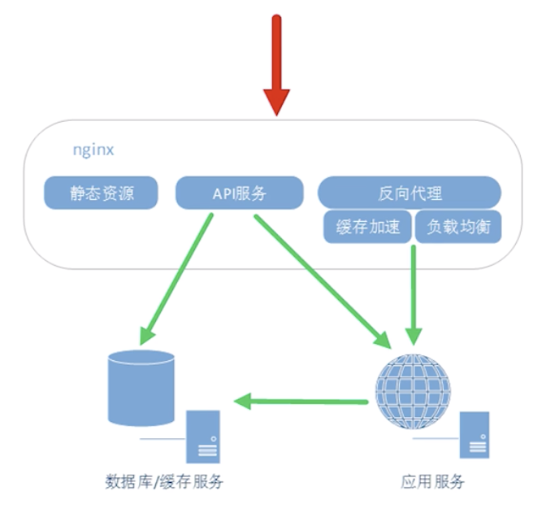

# Nginx基础
---

## Nginx的三个应用场景
* 静态资源服务
    * 通过本地文件系统提供服务
* 反向代理服务
    * Nginx的强大性能
    * 缓存
    * 负载均衡
* API服务
    * OpenResty



```
web请求 -> Nginx -> 应用服务 -> 数据库/缓存
```


应用服务要求开发效率高，往往运行效率比较低。  
一般会将应用服务构成一个集群，然后通过Nginx的反向代理功能把用户的请求正确的发送给应用。  
这会使用到Nginx的缓存加速和负载均衡等功能。  

对于HTML，CSS，图片，前端JS等静态文件没有必要使用应用服务来提供，往往也会放在Nginx的静态资源这一块。 

## Nginx出现的历史背景
Nginx出现的原因：
* 互联网的数据量快速增长
    * 互联网的快速普及
    * 全球化
    * 物联网
* 摩尔定律：性能提升
* 低效的Apache
    * 一个连接对应一个进程（进程间切换消耗的资源太大）

## Nginx的优点
1. 高并发，高性能
2. 可扩展性好
3. 高可靠性
4. 热部署
5. BSD许可证

## Nginx的组成部分
* Nginx二进制可执行文件
    * 由各模块源码编译出得一个文件
* Nginx.conf配置文件
    * 控制Nginx行为
* access.log访问日志
    * 记录每一条http请求信息
* error.log错误日志
    * 定位问题

